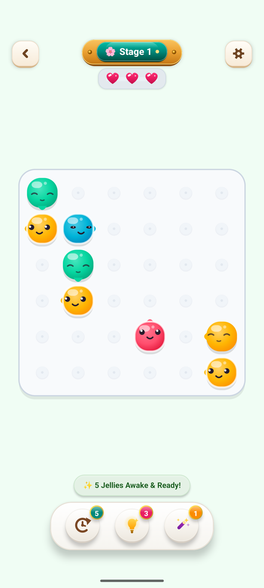
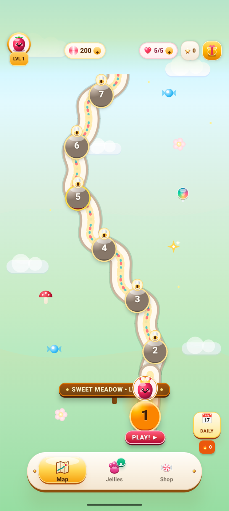
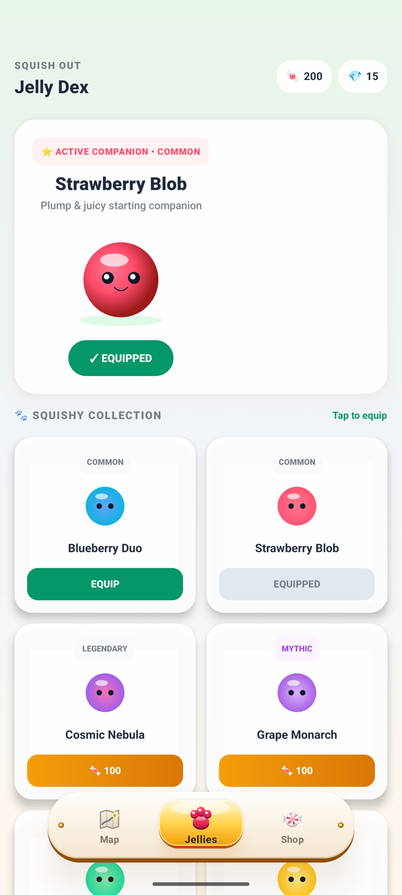
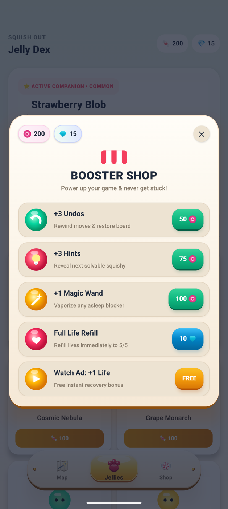
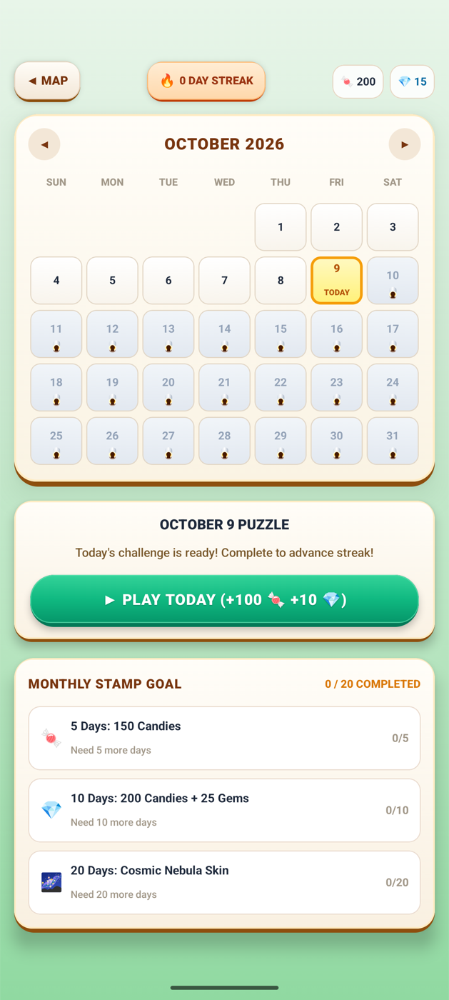
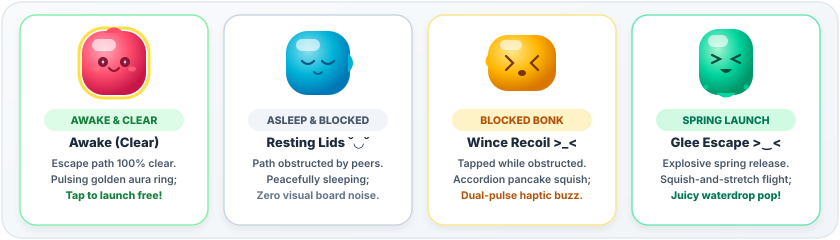
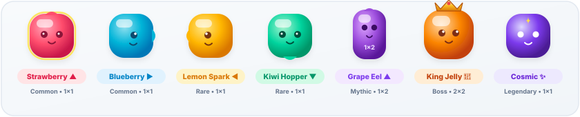
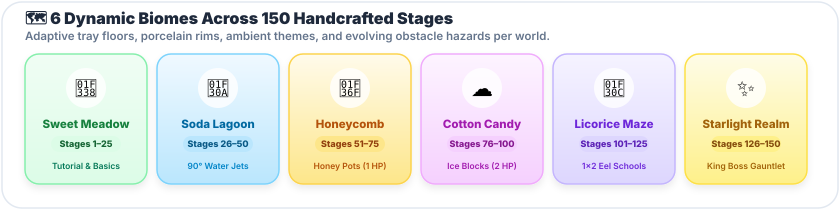

<div align="center">

  

  <br />

  [](https://kotlinlang.org/)
  [](https://www.jetbrains.com/lp/compose-multiplatform/)
  []()
  [](https://developer.android.com/kotlin/multiplatform/room)
  []()
  [](LICENSE)

  <p align="center">
    <strong>🍓 A juicy, tactile evolution of directional unblocking puzzles.</strong><br />
    Replace cold, sterile arrows with living, breathing kawaii gelatin blobs featuring dynamic radial gloss shaders, expressive eyelid states, squish-and-stretch launch physics, and a rich 150-stage saga metagame.
  </p>

  <p align="center">
    <a href="#-gameplay-showcase">📱 Gameplay Showcase</a> •
    <a href="#-the-anti-arrow-innovation">✨ The Anti-Arrow Innovation</a> •
    <a href="#-tactile-physics--game-feel">🎮 Tactile Physics & Feel</a> •
    <a href="#-meet-the-squishies">🐾 Meet The Squishies</a> •
    <a href="#-saga-progression--6-biomes">🗺️ Saga & Biomes</a> •
    <a href="#-architecture--performance">🏗️ Architecture</a> •
    <a href="#-getting-started">🚀 Quick Start</a>
  </p>

</div>

---

## 📱 Gameplay Showcase

<p align="center">
  
  &nbsp;
  
  &nbsp;
  
</p>

<p align="center">
  <em>Live game screens running on device: Tactile 6×6 Game Tray, 150-Stage Stepping-Stone Saga Map, and the Jelly Dex Companion Roster.</em>
</p>

<details>
  <summary><strong>🔍 Click to view additional modal screens (Booster Shop &amp; Daily Puzzle Calendar)</strong></summary>
  <br />
  <p align="center">
    
    &nbsp;&nbsp;
    
  </p>
</details>

---

## ✨ The "Anti-Arrow" Innovation

Traditional spatial unblocking games (such as *Arrow Puzzle*) rely on sterile, monochromatic geometric arrows on flat backgrounds. While the core spatial logic is proven, the visual experience is cold, clinical, and impersonal.

**Squish Out** transforms this logic puzzle into an **irresistible, character-driven arcade experience**:

- **No More Sterile Arrows**: Every puzzle piece is an organic fruit jelly creature (**"Squishy"**) with an inherent anatomical escape vector (tapered directional snout, candy antenna, forward-focused pupils).
- **Living Eyelid Communication**: Trapped jellies sleep peacefully `( ˘ ◡ ˘ )`; unblocked jellies wake up with star-sparkling pupils `( ✦ ‿ ✦ )` and a glowing golden rim, intuitively communicating valid moves with zero visual clutter.
- **Juicy Tactile Feedback**: Tapping an unblocked jelly triggers an explosive squish-and-stretch spring launch into the meadow accompanied by procedural waterdrop pops (`ploink!`) and multi-tier haptics.
- **100% Solvable Guarantee**: A pure zero-dependency reverse-assembly generator (`:core-engine`) mathematically guarantees every board is solvable without frustrating dead-ends.

<div align="center">
  
</div>

<br />

### 👁️ Eyelid & Movement State Reference

| State | Expression | Visual Feedback | Game Mechanic & Meaning |
| :--- | :---: | :--- | :--- |
| **Awake & Clear** | `( ✦ ‿ ✦ )` | Bright star pupils, pulsing golden rim aura, gentle idle pulse | **Ready to escape!** Escape corridor to tray edge is 100% clear. Tap to launch free. |
| **Asleep & Blocked** | `( ˘ ◡ ˘ )` | Curved resting eyelids, relaxed smile, zero rim glow | **Obstructed.** Path is blocked by a peer or barrier. Resting quietly with zero board noise. |
| **Blocked Bonk** | `( > _ < )` | Dizzy wince, accordion pancake squish, damped rebound | **Tap Refusal!** Tapped while obstructed. Rubbery thud audio with dual-pulse haptic recoil. |
| **Spring Launch** | `( > ‿ < )` | Joyful squint glee, squish-and-stretch flight, trailing droplets | **Escape!** Explosive spring takeoff along vector with high-pitched popping audio. |

---

## 🎮 Tactile Physics & Game Feel

### 🍓 4-Tier Tactile Juice System
Squish Out is built around dopamine-rich tactile responsiveness at every frame:

1. **Idle Harmonic Breathing**: Every jelly gently breathes via a volume-preserving sinusoidal wave (`scaleX = 1 + wave`, `scaleY = 1 - wave`) so the board feels organic and alive.
2. **Touch Anticipation**: Touching a jelly immediately compresses it under the player's finger (`scaleX = 1.14`, `scaleY = 0.86`) before finger lift.
3. **Explosive Spring Release**: Unblocked launch springs forward along its escape vector (`scaleAlongVector = 1.55`, `scaleOrthogonal = 0.70`) with cubic overshoot curves and 4–6 trailing droplet particles.
4. **Accordion Rebound & Screen Shake**: Tapping a blocked jelly triggers damped harmonic rebound (`-6px -> +4px -> -2px -> 0px`) and physical tray shake.

### ❄️ Interactive Obstacles & Deflectors

- **🪨 Mossy Meadow Rock**: Indestructible monolithic stone; jellies must navigate around its permanent footprint.
- **❄️ Frosted Ice Block (2 HP)**: Crackable barrier featuring custom Skia fracture crack lines upon first impact, shattering into crystal shards on the second.
- **🍯 Honey Pot (1 HP)**: Dripping golden glaze pot that bursts open upon impact, freeing trapped jellies behind it.
- **🌊 90° Water Jet Deflector**: Tray conveyor tile that dynamically redirects an escaping jelly's straight escape vector by 90 degrees, bending around walls and obstacles!
- **🌫️ Bubble Fog & Schooling Pairs**: Cloud mist obscuring orientation until nearby tiles are cleared, plus symbiotic pairs that require synchronized dual-lane corridors.

---

## 🐾 Meet The Squishies

Each companion creature in the **Jelly Dex** possesses directional escape anatomy, custom radial gloss shaders, and metagame perks:

<div align="center">
  
</div>

<br />

| Companion | Vector | Rarity | Grid Size | Metagame Perk & Trait |
| :--- | :---: | :---: | :---: | :--- |
| **🍓 Strawberry Blobby** | ▲ North | Common | `1×1` | Plump & cheerful starting companion; balanced nimble escape. |
| **🫐 Blueberry Drop** | ▶ East | Common | `1×1` | Calm and cool; two-step smooth slide rhythm. |
| **🍋 Lemon Spark** | ◀ West | Rare | `1×1` | Zesty adventurer; grants **+10% bonus Candies** on 3-star finishes. |
| **🥝 Kiwi Hopper** | ▼ South | Rare | `1×1` | Bouncy garden friend; awards **+1 Free Daily Hint** in the booster dock. |
| **🍇 Grape Eel Duo** | ▲ North | Mythic | `1×2` | Contiguous 2-tile multi-piece; requires dual clear corridor; leaves rainbow trails. |
| **👑 Honeycomb King Jelly** | ▲ North | **Boss** | `2×2` | Giant 4-cell royal sovereign with golden crown; triggers full-screen confetti! |
| **🌌 Cosmic Nebula** | ★ Multi | Legendary | `1×1` | Unlocked via 30-day Daily Puzzle streak; radiates pulsing stardust aura. |

---

## 🗺️ Saga Progression & 6 Biomes

Experience a 150-stage winding stepping-stone saga across 6 dynamically themed worlds. Each biome customizes the tray enamel, porcelain rim, floor reflections, and ambient foliage:

<div align="center">
  
</div>

<br />

| Biome | Stages | Theme & Visual Atmosphere | Unique Obstacle & Mechanic Hazards |
| :--- | :---: | :--- | :--- |
| **🌸 Sweet Meadow** | 1–25 | Lush mint grass, wild daisies, warm porcelain rims | Foundational unblocking, mossy meadow rocks |
| **🌊 Soda Lagoon** | 26–50 | Turquoise fizzy water, water lilies, bubble streams | **90° Water Jet deflectors** bending escape rays |
| **🍯 Honeycomb Valley** | 51–75 | Warm amber trays, honeycombs, floral pollen | **Honey Pots (1 HP)** with dripping glaze |
| **☁️ Cotton Candy Peak** | 76–100 | Pastel magenta & violet cloud banks, mist | **Frosted Ice Blocks (2 HP)** with Skia fracture lines |
| **🌌 Licorice Labyrinth** | 101–125 | Deep twilight lavender corridors | **1×2 Eel Schools** & symbiotic pairs |
| **✨ Starlight Kingdom** | 126–150 | Radiant golden celestial citadel | **2×2 King Jelly Boss Rush** gauntlets |

- **🏆 Daily Puzzle Calendar**: A dedicated monthly calendar mode featuring progressive difficulty streaks and exclusive skins like *Cosmic Nebula*.
- **🎁 Milestone Star Chests**: Earn 3-star ratings across saga stages to unlock wooden and porcelain star chests filled with Gems and Candies.
- **💖 Heart Regeneration Economy**: 1 life regenerates automatically every 20 minutes (up to 5 maximum hearts), persisted locally with Room KMP.
- **🛍️ Booster Dock & Shop**: In-tray capsule buttons for **💡 Hint** (raycasts the optimal move), **🪄 Squish Wand** (dissolves any blocking obstacle), and **↺ Undo**.

---

## 🎶 Audio & Haptic Architecture

- **Zero-Asset Procedural 16-Bit PCM Audio Engine**:
  - Generates real-time mathematical audio waveforms (`POP`, `WOBBLE`, `VICTORY`, `CRACK`, `BOOSTER`) without requiring heavy audio asset bundles.
  - Seamlessly dispatched via Android `SoundPool` and iOS `CoreAudio` / `AVAudioPlayer`.
  - Looping cozy ambient background soundtrack with dedicated settings mute toggles.
- **Multi-Tier Native Haptic Feedback**:
  - `LIGHT_CLICK` (25ms) — Standard jelly launch.
  - `ERROR_WOBBLE` (80ms) — Blocked tap collision.
  - `CRACK_THUMP` — Double-pulse waveform on obstacle fracture.
  - `VICTORY_FANFARE` — Apple CoreHaptics success notification / Android victory pattern on stage completion.

---

## 🏗️ Architecture & Performance

```
SquishOut/
├── 🎮 core-engine/         # Pure Kotlin (Zero-Dependency) Engine
│   ├── generator/          # ReverseAssemblyGenerator (100% solvable puzzle logic)
│   ├── model/              # Jelly, Board, Obstacle, WaterJet, Direction, DifficultyTier
│   └── GameEngine.kt       # Unidirectional State Machine (taps, undos, hints, solver)
│
├── 🎨 shared/              # 100% Shared UI & Data (Compose Multiplatform)
│   ├── board/              # Skia Custom Canvas, JellyRenderer, TrayRenderer, ParticleSystem
│   ├── data/               # Room KMP Database (SQLiteDriver), LevelDao, JellySkinDao
│   ├── presentation/       # GameViewModel, StateFlow reactive pipelines
│   ├── theme/              # BiomeTheme (6 palettes), SquishColors, SquishTypography
│   └── ui/                 # SagaMapScreen, GameScreen, JellyDexScreen, 3D Porcelain Modals
│
├── 🤖 androidApp/          # Native Android Application (SDK 35, Ladybug/Meerkat)
└── 🍎 iosApp/              # SwiftUI iOS Application hosting Shared.framework
```

### ⚡ 120 FPS Skia Rendering Performance
- **Zero Per-Frame Allocations**: `JellyRenderer`, `TrayRenderer`, and `SkiaBoardView` utilize pre-allocated scratch `Path`, `CornerRadius`, and `Brush` caches to eliminate garbage collector stutter during 120 FPS animations.
- **Retina & High-DPI Vector Clarity**: 100% mathematical vector geometry ensures zero pixelation on tablets, foldables, and ultra-high-density displays.

---

## 🛠️ Tech Stack

| Layer | Component | Version | Role |
| :--- | :--- | :--- | :--- |
| **Language** | Kotlin Multiplatform | `2.4.20` | Cross-platform core logic & UI |
| **UI Framework** | Compose Multiplatform | `1.12.1` | Declarative shared UI across Android & iOS |
| **Graphics** | Skia Custom Canvas | Integrated | 120 FPS custom shaders, gloss speculars & paths |
| **Database** | AndroidX Room KMP | `2.8.5` | Offline-first relational game persistence |
| **Driver** | AndroidX SQLite | `2.6.2` | Bundled C-SQLite driver for iOS & Android |
| **DI** | Koin Multiplatform | `4.2.2` | Clean dependency injection |
| **Coroutines** | Kotlinx Coroutines | `1.10.1` | Asynchronous flows, tick clocks & timers |
| **Build Tooling**| AGP & Gradle | `9.1.1` | Modern build configuration |

---

## 🚀 Getting Started

### Prerequisites
- **JDK 17+** (JDK 17 or Azul Zulu 21 recommended)
- **Android Studio Ladybug / Meerkat** (Android SDK 35+)
- **Xcode 16+** (for iOS simulator & device builds)

### Clone & Build
```bash
git clone https://github.com/Shahidzbi4213/SquishOut.git
cd SquishOut
```

#### Run All Unit & Engine Tests
```bash
./gradlew :core-engine:jvmTest :shared:testAndroidHostTest
```

#### Assemble Android Debug APK
```bash
./gradlew :androidApp:assembleDebug
# Output APK: androidApp/build/outputs/apk/debug/androidApp-debug.apk
```

#### Link iOS Framework (Simulator)
```bash
./gradlew :shared:linkDebugFrameworkIosSimulatorArm64
# Output Framework: shared/build/bin/iosSimulatorArm64/debugFramework/Shared.framework
```

---

## 🧪 Testing Coverage

The repository maintains **100% test coverage** for all game logic, level generation, and data persistence:

- `ReverseAssemblyGeneratorTest`: Mathematical verification that every generated board across 150 stages is 100% solvable.
- `BoardRaycasterTest`: Corner raycasts, obstacle collisions, 90° water jet trajectory deflections, and multi-cell piece clearances.
- `GameEngineTest`: Direct tap state transitions, undo stacks, hint solvers, and star calculations.
- `GameRepositoryTest`: Room DAO transactions, 20-minute heart refill timer calculations, and currency economies.

---

## 📄 License

This project is licensed under the MIT License — see the [LICENSE](LICENSE) file for details.

<div align="center">
  <sub>Crafted with 🍓, Kotlin Multiplatform, and Compose Multiplatform.</sub>
</div>